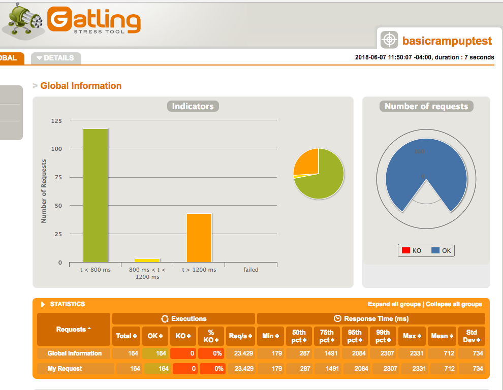

# Titanium Lambda

_Titanium Lambda_ is an opinionated set of guidelines and processes for building stable, robust, and successful serverless functions. 

### Key Features of Titanium Lambda Projects: 
- Full CI / CD Pipeline with AWS CodePipeline or Travis CI.
- Has 4 different types of automated tests written with Mocha + Chai.
- Automated developer sugars like easlint, jsdoc, and git hooks.
- Incorporates Serverless Framework for an alternative quick, convenient deployment. 
- Solid disaster recovery strategies.
- Perform regular load testing with Gatling.
- Example project, code, and template files to use as a template.

## Example Project
This project is an example of a project that follows the Titanium Lambda guidelines. This specific lambda function is can be accessed as a REST API that you can call using a GET request with the query parameter, "character". The service will then return a json object containing some data about a star wars character corresponding to that number: their name, hair cookie, and eye color. 

Try hitting the live endpoint via putting it in your browser address bar, ajax, curl, postman, or some other REST client!  

https://ax7ezyq21m.execute-api.us-east-1.amazonaws.com/Prod?character=1

You can change the value of the _character_ query paramter in the url to an integer between 1 and 10 (other numbers work, but it officially supports 1 through 10). The service then calls out to the [star wars api](https://swapi.co/), parses the result, and returns the character's name, eye color, and hair color.

## The Meta Project 
The Star Wars endpoint could be switched out for any asynchronous api (or series / combination of api calls). This is a great example of how to make clean, thoroughly testsed Nodejs microserverices that are performant, efficient, and _actually_ do scale to any amount of traffic all on their own. This project is a tangible manifestation of the teachings of Titanium Lambda.

## Why Titanium Lambda?
When it comes to working with AWS Lambda, there are't a lot of "enterprise level" tutorials. Many people learn the basics, upload some code right into the web console, and stop there thinking that's all there is to building Lambda functions. It can be tough figuring out how to deploy efficiently, being disciplined enough to write all the various automated tests, and being aware of where to look when things go wrong. You want to step up your serverless game and build robust, legit Lambda functions then this guide is for you.

# What are we selling?
Nothing! Titanium Lambda is totally free to use and is not influenced by commercial interests. Titanium Lambda was a result of Jim Lynch working professionally with the tools, honing his skills, and over time formulating this guide as a way of organizing his thoughts and building somewhat of a "turnkey" development process for his own personal and professional lambda functions. If you like this project, feel free to [tweet to Jim](https://twitter.com/WebWhizJim) and say thanks. :)  

## The CodeStar Dashboard
There are various ways of starting your project, but Titanium Lambda recommends using [AWS CodeStar](). basically sets up CodePipeline for you, provisions some resources, and provides you with a nice dashboard for monitoring your project.

You can find the Codestar dashboard for this proejct[here](https://console.aws.amazon.com/codestar/home?region=us-east-1#/projects/jims-cepsnlm/dashboard). 
_(Note: You won't be able to acess the codestar dashboard unless specifically given permissions by Jim.)_

## More Reasons Why Serverless is Awesome
I do a lot of front-end javascript development, and honestly I find aws lambda nodejs to be way more fun and interesting. I love how serverless is so small and focused, and I think it just makes it that much easier to have 100% code coverage (not to mention you don't have all that view markup to worry about). I love that in serverless development you are quantitatively rewarded for making your code more efficient since you can measure the execution time and max memory used, comparing the numbers over time to find which version of the code works best.

## Optional "Impatient Deploy" With Serverless Framework
Although having Amazon's CodePipeline hooked up to this project is pretty awesome, the waiting time for the stages of CodePipeline can just be too unbearably slow for me.

For a much faster feedback loop you can deploy to another environment, independent of your pipeline environments, which I like to call the "impatient environment". You can do this with the [serverless](https://github.com/serverless/serverless) framework CLI and (included here) serverless.yml configuration file.

First, install the serverless npm module globally:

`npm i serverless -g`

You will also need to provide access to the cli tools so they can push to your AWS account. This can be done with the aws cli _configure_ command:

`aws configure`

Then you can deploy like this:

`serverless deploy`

## Easy DevOps AWS CodePipeline

When you make a project with AWS Codestar is automtaically sets up CodePipeline which is a configurable, flexible build, test, and deploy pipeline to which one can add or remove any number of steps. I think my ideal pipeline steps would look something like this.

- Run pre-commit hook (lint, unit tests, integration tests, smoke tests)
- Commit code to the git repository.
- Push code to git repository.
- Code gets automatically picked up by AWS CodePipeline build server.
- Runs pre-build tests (lint, unit tests, integration tests, smoke tests).
- Generate JsDcoc.
- Build project (using buildspec.yml file in project root).
- Deploy to dev environment
- Run load tests against dev environment (optional).
- Run e2e tests against live dev environment.
- manually approve deployment from Dev to prod
- deploy to prod

## Unit Tests

The unit tests are meant to test functions in isolation, mocking basically all dependencies. The Unit tests make heavy 
use of stubs and spies from the sinon.js library to ensure of one little "unit" of code at a time.

If you don't have mocha installed globally, please do that first:

`npm i -g mocha`

Then you can run the units tests like so:

`npm test`

Then you can run the test and generate code coverage reports:

`npm test-coverage`

note: in order to run this have you have instabul installed globally:

`npm i -g istanbul`

Notice that right now this template project has 100% test coverage!

## E2e Tests

E2e, or "end-to-end" tests can have different meanings in different situations. For front-ends frameworks e2e testing
often involves browser automation, something that doesn't really make sense for a lambda function. In this project I have
two types of e2e tests: 

- rest endpoint e2e tests
- small integration tests

These correspond to the files in the e2e-tests/ folder in the root of this project. They are both run with the command:
`npm run e2e-test`

#### Rest endpoint e2e tests
These tests use the supertest library to hook into the express middleware and basically simulate firing the REST event 
to your function and expecting that the correct response is returned, including headers and authotization-headers. These tests really try to covert the whole lambda function, beginning when the REST request first comes in and veryfying that the right response is sent from the lambda function back to the client. Since hese tests use the supertest library to hook into the express middleware they basically simulate firing the REST event to your function and then expect that the correct response is returned, including headers and authotization-headers.

#### Small Integration Tests
These are similar to unit tests in that they aim to verify the correct return values for individual functions tested in 
isolation. However, unlike unit tests which have side effects such as external requests mocked, these tests allow the functions to call the external apis without mocking or stubbing anything. If there is a problem or bug ocurring in the code directly around the your async code wrappers, these tests can really expose that.

## BDD Tests
Bevaior driven development is awsome! But when it comes to the code, what does bdd really mean? In the world of Nodejs it
basically comes to to using CucumberJS to run your "feature files" and "step definition files". Although I haven't yet 
added npm scripts to execute the bdd tests, I have an example feature file that you might use for this project. Feature files are awesome because they are written in Gherkin syntax. This reads like plain english, but can also be executed from the command line just like other automated tests. 

## Performance Tests

When it comes to aws lambda functions, you can quantitatively measure the performane of every execution with two numbers: __max memory used__ and __duration of function execution__. Measuring the performance of aws lambda functions is actually very easy since every execution of your aws lambda function will output these numbers in the cloudwatch logs (and in the aws lambda console if invoking the function from there). I don't currently have an automated script for performance tests like I do for the other automated tests, but to me performance is something to look at, compare, and improve over time as the function is in use.

## Load Tests with Gatling
For load testing REST endpoints my favorite tool is [Gatling](https://gatling.io/). It's very awesome for a number of reasons:
  - Efficiently uses Akka messages instead of real threads.
  - Has a clean, succinct DSL to describe your load tests.
  - Outputs pretty charts for analyzing test results.
  - Easily run from shell with a single command (and can be run in CI pipeline!).
  - Has a badass gatling gun logo.
  
Unfortunately, there is no npm package for gatling. The way that I normally add gatling to a project is to just go to the [gatling download page](https://gatling.io/download/), download the gatling folder, and just drop the folder into your project.

Gatling can be used to perform load testing on the live lambda function endpoint. 
With gatling we can hit the endpoint with X number of concurrent connections and then look at the metrics of how the function performs.
 
_Note: Running gatling load tests require Java 8 JDK._
 
To run load tests:
 
`npm run load`
 
This will call gatling.sh and runs the simulation specified with the -s flag.
 
Results will then be output to `/tests/gatling-2.3.1/results`.
 
This will create a nice little dashboard with charts which you can view by opening the generated index.html file in a browser. The charts will look something like this:

 
The tests in Gatling are called "simulations", and the simulation files are written in Scala (but don't be afraid of them!).
 
The main load test simulation for this project is located here: `tests/load/gatling-2.3.1/user-files/simulations/default/user-embed-lambda.load.test.scala`.
 
_Note: Load tests are currently _**not**_ run as part of the CI pipeline._
  
## Hot Vs Cold Functions
It's very interesting to see just how much the response times of a Lambda function can vary for consecutive executions of the exact same Gatling simulation. For example, here's the results of test calling a 512mb Lambda function via a POST endpoint where I'm ramping up the number of users per second from 10 to 50 over 5 seconds.

##### Gatling output, run 1:

##### Gatling output, run 2:

##### Gatling output, run 3:

From the above screenshots we can see that in the first run, when the lambda is "cold", the average response time was 712ms with a worst case of 2331ms. In the second run, only about 10 seconds later, we can see times improve to an average response time of 376ms with an interestingly worse worst case than the first run. In the final run things look even better with an average response of 289ms and a worst case of only 1254. The key thing to remember is that there can cold lambdas can have some variability with execution duration, and the only way to get "hot" response times all the time is to have an endpoint with a large flow of consistent traffic.

  
## Amazon X-ray Performance Analysis 
With each executive of a lambda function you get the total number of milliseconds for which you were billed, but there's no insight into what what going on during that time. Amazon X-ray is a neat service that shows a visual timeline of what's happening during you function execution so you can we how much time the nodejs engine took to start up, how much time each of your functions take to complete, etc. Note that this protect is not currently at up to use aws x-ray, but it would take only a few lives if cute to add it. Tools like Gatling are great for telling you if your service is slow but not _why_ it's slow. Once you see that your service is running to slowly, Amazon X-Ray is an excellent tool allow you to see what function of your coding are taking longest.

## JsDoc
I'm definitely a fan of making your code more readable and easier to understand. I've tried to annotate my functions in this project with descriptions and @param / @return type descriptions. 

## Included Files for AWS DevOps Pipeline

* buildspec.yml - this file is used by AWS CodeBuild to package your
  service for deployment to AWS Lambda
* template.yml - this file contains the AWS Serverless Application Model (AWS SAM) used
  by AWS CloudFormation to deploy your service to AWS Lambda and Amazon API
  Gateway.

## More AWS Links

Learn more about AWS CodeBuild and how it builds and tests your application here:
https://docs.aws.amazon.com/codebuild/latest/userguide/concepts.html

Learn more about AWS Serverless Application Model (AWS SAM) and how it works here:
https://github.com/awslabs/serverless-application-model/blob/master/HOWTO.md

AWS Lambda Developer Guide:
http://docs.aws.amazon.com/lambda/latest/dg/deploying-lambda-apps.html

Learn more about AWS CodeStar by reading the user guide, and post questions and
comments about AWS CodeStar on our forum.

AWS CodeStar User Guide:
http://docs.aws.amazon.com/codestar/latest/userguide/welcome.html

AWS CodeStar Forum: https://forums.aws.amazon.com/forum.jspa?forumID=248

## Why "Titanium"?
Titanium is one of the densest materials on earth. It has been battle-tested and is used for the most extreme industries such artillery, military, and aerospace. Titanium is also especially recognized for its high strength-to-weight ratio, and it thinks a parrallel can be drawn with Lambda functions as they are meant to be both super powerful / scalable yet very lightweight.

## Official Song
The official song of the Titanium Lambda project is [Titanium by David Guetta & Sia](https://www.youtube.com/watch?v=JRfuAukYTKg).

Imagine your Lambdas singing along to the lyrics:

  _`♪ You shoot me requests, but I won't fail! I AM TITAAAAANNNNNNIIIIIIIUUUUUUUUUUUMMMM! ♪`_

## Thanks!

Thanks to all the contributors who have helped make this project awesome!

If you are new to this project, feel free to open issues with questions or suggestions, join our [slack group](https://join.slack.com/t/titaniumlambda/shared_invite/enQtMzc2ODQ4ODgyNjI4LTQyYzc4Mzc4Yzg2YmZkZGU2ZGFlMjliNmQ3MmVjYmQwYzkxZGUwZDVlZWNhNTNlODg0NTk2Yzc1YWYyNzliYWQ), and if you like this repo please give it a star!
